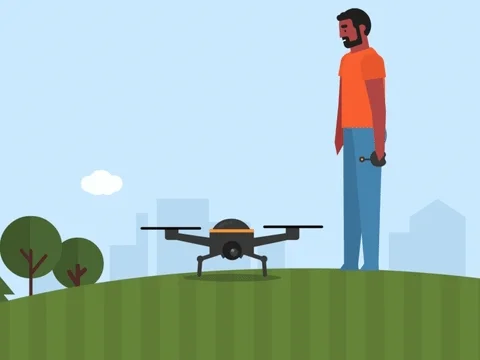

<h2 align="center">Giriş Cümlesi  </h2>

- 🔭 Şuan da **Görüntü İşleme** üzerinde çalışıyorum.

- 🌱 Şuan da **Opencv, Keras ve FastAPI** teknolojilerini öğreniyorum.

- 📝 Yakında bilgisayar görü ve otopilot yazılımlarımı medium üzerinden paylaşacağım. [Medium](https://medium.com/@aynur.susuz.5561)

- 📫 Mail üzerinden bana ulaşabilirsiniz. **aynur.susuz.5561@hotmail.com** 

**💻 Çalıştığım Teknolojiler:**

<code></code>
<code></code>
<code></code>
<code></code>
<code></code>

## Projelerim
<table bordercolor="#66b2b2">
  <tr>
    <td width="33%" valign="top">
      <h3>İnsansız Hava Aracı için Hedef Tespit Sistemi</h3>
         
        
        
<strong>Örnek Açıklama Cümlesi:Yolov4 + TensorRT</strong> - Yapay zeka teknolojilerini kullanarak Savaşan İnsansız Hava Araclar için  hedef tespit takip ve hedefe kitlenme gibi algoritmaların geliştirilmesi hedeflenmektedir.

        
<a target="_blank" href="https://github.com/aynursusuz/HAREKETLI-NESNE-TAKIBI">Repo</a> 

    </td>
    <td width="33%" valign="top">
      <h3>Basit Şekil Takibi(Basiy)</h3>
         
        
        
<strong>ROS & Python </strong> -İnsansız hava araçları için rota planlama ve analiz/tahmin algoritmaları kullanarak otonom rota planlama algoritmaları geliştirilmektedir.
  
        
<a target="_blank" href="https://github.com/aynursusuz/simple-shape-detection">Repo</a> 

    </td>
  </tr>
</table>
