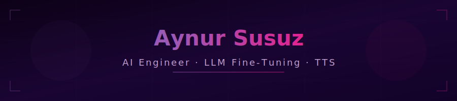

<!-- Header Banner -->

  

  

<!-- About Me -->
<h2 align="center">🧠 About Me</h2>

  AI Engineer at <b>Vyvo Labs</b> based in Ankara, Turkey. 
  I specialize in fine-tuning large language models and building production-grade TTS systems. 
  Focused on pushing open-source models to their limits with LoRA, QLoRA, and Unsloth.

 

<!-- Tech Stack -->
<h2 align="center">🛠 Tech Stack</h2>

  
  
  
  
  
  

 

<!-- Currently Working On -->
<h2 align="center">🔬 Currently Working On</h2>

  <b>·</b>&ensp;LLM fine-tuning with LoRA / QLoRA / Unsloth for domain-specific tasks 
  <b>·</b>&ensp;TTS model development and voice synthesis for Turkish language 
  <b>·</b>&ensp;Building efficient training pipelines on consumer-grade GPUs

 

<!-- GitHub Stats -->
<h2 align="center">📊 GitHub Stats</h2>

  <table align="center">
    <tr>
      <td>
        
      </td>
      <td>
        
      </td>
    </tr>
  </table>

  

 

<!-- Footer -->

  
  &nbsp;
  

  

