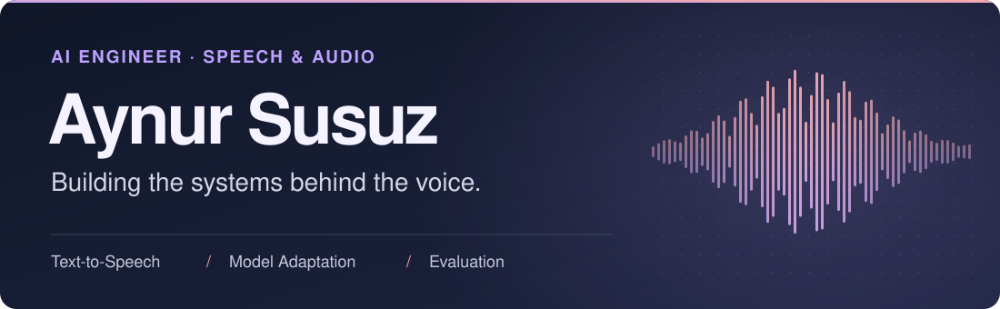

<picture>
  <source media="(max-width: 600px)" srcset="./assets/header-mobile.svg">
  
</picture>

  
  
  
  

**AI Engineer at Vyvo Labs** · One year building text-to-speech systems.

**[Hugging Face](https://huggingface.co/Aynursusuz)** &nbsp; / &nbsp; **[LinkedIn](https://www.linkedin.com/in/aynur-susuz/)** &nbsp; / &nbsp; **[Email](mailto:aynur.susuz.5561@gmail.com)**

## Synthetic speech

<a href="https://huggingface.co/datasets/SynDataLab-EN/qwen-clones-4m-en"><picture><source media="(prefers-color-scheme: dark)" srcset="./assets/dataset-qwen-dark.svg?v=2"></picture></a><a href="https://huggingface.co/datasets/SynDataLab-EN/echo-clones-4m-en"><picture><source media="(prefers-color-scheme: dark)" srcset="./assets/dataset-echo-dark.svg?v=2"></picture></a> <a href="https://huggingface.co/datasets/SynDataLab-JA/irodori-clones-3m-v2-no-emoji"><picture><source media="(prefers-color-scheme: dark)" srcset="./assets/dataset-irodori-dark.svg?v=2"></picture></a><a href="https://huggingface.co/datasets/SynDataLab-EN/tts-pretrain-clones-3m-mos"><picture><source media="(prefers-color-scheme: dark)" srcset="./assets/dataset-dnsmos-dark.svg?v=2"></picture></a>

**Also published:** [Irodori Japanese voice clones — 2.99M clips ↗](https://huggingface.co/datasets/SynDataLab-JA/irodori-clones-3m)

### Text for speech synthesis

| Dataset | Language | Text rows |
| :--- | :---: | ---: |
| **[Mandarin conversations](https://huggingface.co/datasets/SynDataLab-EN/chinese-tts-text-10m)** |  | **~5.8M** |
| **[EchoTTS source text](https://huggingface.co/datasets/SynDataLab-EN-Refs/echo-4m-text-en)** |  | **4M** |
| **[DeepSeek Flash](https://huggingface.co/datasets/SynDataLab-JA-Refs/DeepSeekFlash-3M-ja)** |  | **~2.80M** |
| **[DeepSeek Flash](https://huggingface.co/datasets/SynDataLab-EN-Refs/DeepSeekFlash-3M-en)** |  | **~2.70M** |
| **[DeepSeek Pro](https://huggingface.co/datasets/SynDataLab-EN-Refs/DeepSeekPro-1M-en)** |  | **1M** |

Sizes from dataset cards and Hub metadata · September 2026

## Models & evaluation

- **[Italian Qwen3-TTS ↗](https://huggingface.co/Aynursusuz/Qwen-TTS-Best-Model)** — Fine-tuned on 115K audio samples.
- **[Voice-cloning benchmark ↗](https://huggingface.co/datasets/Aynursusuz/tts-multiling-clone-6model)** — 6 models · 3 languages.
- **[Audio Quality Assessment ↗](https://huggingface.co/spaces/Aynursusuz/Audio-Quality-Assessment)** — Live demo.

Hugging Face organizations

- **Synthetic speech:** [SynDataLab-EN](https://huggingface.co/SynDataLab-EN) · [SynDataLab-JA](https://huggingface.co/SynDataLab-JA)
- **Reference voices & text:** [SynDataLab-EN-Refs](https://huggingface.co/SynDataLab-EN-Refs) · [SynDataLab-JA-Refs](https://huggingface.co/SynDataLab-JA-Refs)
- **Audio datasets:** [AIGenLab](https://huggingface.co/AIGenLab) · [yt-data-1](https://huggingface.co/yt-data-1)
- **Team research:** [Vyvo](https://huggingface.co/Vyvo) · [Vyvo-Research](https://huggingface.co/Vyvo-Research)

`Python` · `PyTorch` · `Transformers` · `CUDA`
